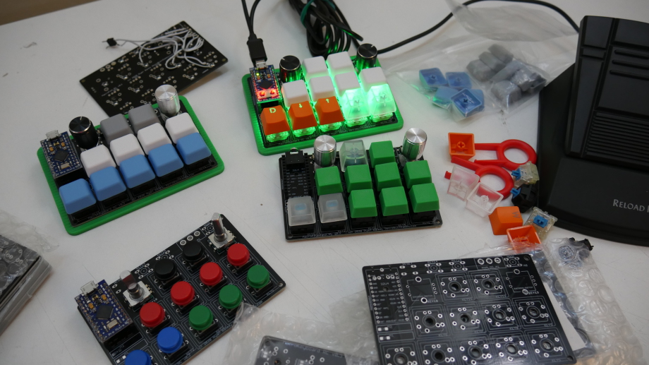
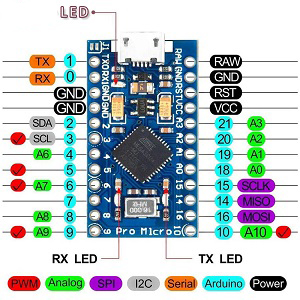

## Videos

[Programmable Macro Keyboard with an Arduino Pro Micro (32u4), Cherry Switches + Stealth Foot Pedal](https://www.youtube.com/watch?v=acJ6gufBN_A)

[Arduino Pro Micro Macro Keyboard Version 2.0 | DIY Macro Pad for Professional Keyboard Slayers](https://www.youtube.com/watch?v=IDlcxLQ1SbY)

## Materials
+ [Pro Micro](https://shopee.tw/%E3%80%90%E7%A5%A5%E6%98%8C%E9%9B%BB%E5%AD%90%E3%80%91Arduino%E7%B3%BB%E5%88%97%E5%A5%97%E4%BB%B6-Pro-Micro-5V-16MHZ-ATmega23U4-i.27742636.9677302240)
+ STM32 Chips
+ [Cherry MX Switch x ?](https://shopee.tw/%E6%AB%BB%E6%A1%83%E8%BB%B8-%E5%BE%B7%E5%9C%8B-cherry%E8%BB%B8-MX%E8%BB%B8-%E6%A9%9F%E6%A2%B0%E5%BC%8F%E9%8D%B5%E7%9B%A4-%E6%A9%9F%E6%A2%B0%E8%BB%B8-%E9%9D%92%E8%BB%B8-%E7%B4%85%E8%BB%B8-%E8%8C%B6%E8%BB%B8-%E9%BB%91%E8%BB%B8-i.73469471.1449623960?sp_atk=cd9a55d7-00af-4006-9577-42cfe9ada966&xptdk=cd9a55d7-00af-4006-9577-42cfe9ada966)
+ PCB or perfboard
+ EC11 Rotary Encoders
+ resistor and capacitor and diode
+ 

## Reference

## Add-up function - USB Hub
### Reference
+ [DIY USB 2.0 4 port hub](https://hackaday.io/project/183688-diy-usb-20-4-port-hub)
+ [ Design and Build your own High Power USB Hub Port Extender](https://circuitdigest.com/electronic-circuits/diy-hub-port-extender)

## Pin

Pinout setting follows the configuration of **Retro** (for some ease and simplicity).

The row pins are `2, 3, 4, 5`, column pins are `6, 7, 8, 9` and the two encoders use `10, 16` and `14, 15` respectively.

`RST` pin is connected to a switch to reset the device.
Connect pin `18` to a `20k` pull-up resistor and a switch to change mode.

